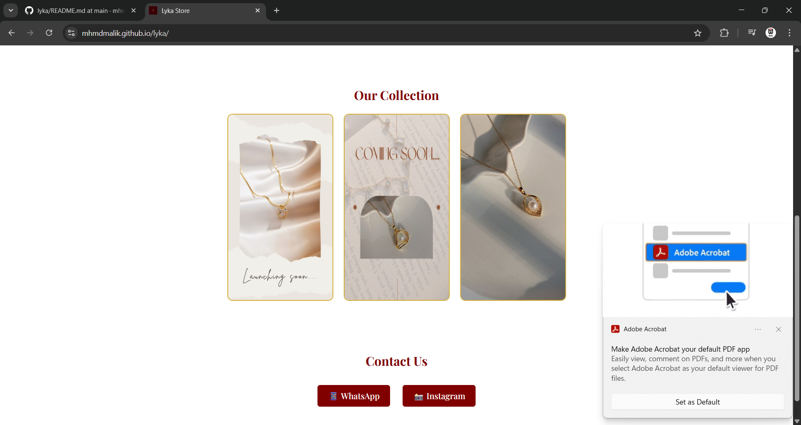
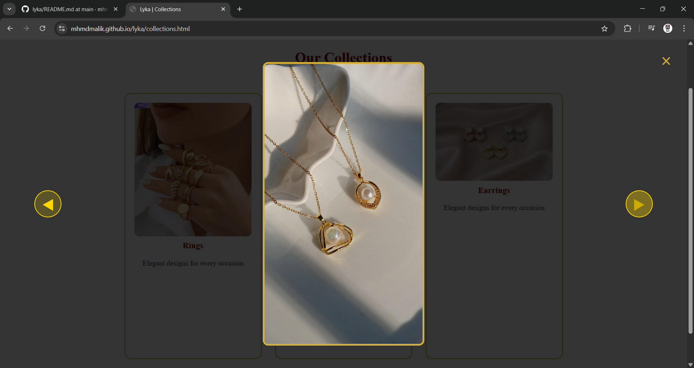
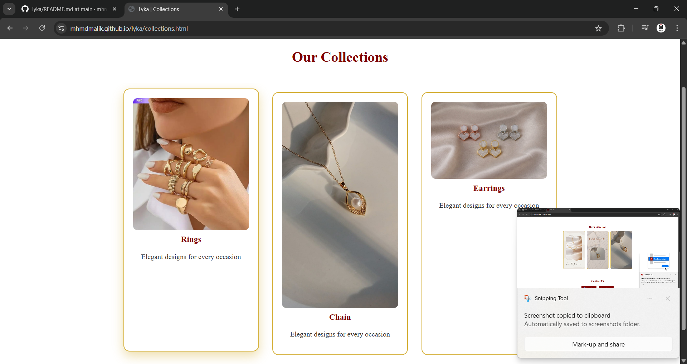

# Lyka – Jewelry Brand Website 💎

**Lyka** is a clean and responsive website built for a home-based jewelry brand. It showcases jewelry collections with elegant UI and lightweight design, perfect for small businesses looking to display products online.

## 🚀 Live Demo
https://mhmdmalik.github.io/lyka/

## 📌 Project Overview
This project is a static web application built using **HTML, CSS, and JavaScript**. It includes product imagery, interactive galleries, and a layout that highlights collections beautifully.

---

## 🛠️ Features

- ✨ Elegant homepage with brand showcase
- 🖼️ Product collections display
- 🖱️ Interactive image lightbox
- 📱 Fully responsive layout
- 🎨 Custom styles tailored to a jewelry brand

---

## 📦 Tech Stack

| Frontend |
|----------|
| HTML      |
| CSS       |
| Firebase  |

*The site now leverages a lightweight Firebase integration for a dynamic product catalog, while remaining blazing fast and easy to host.*

---

## 📁 Project Structure

```

├── index.html
├── style.css
├── app.js            # Main storefront logic
├── admin.html        # Secure backend dashboard
├── admin.js          # Admin logic & Firebase auth
├── collections.html  # Dedicated product grid
├── firebase-config.js # Firebase API keys (Git ignored)
├── seed.mjs / seed-all.mjs # (Optional) One-time database seeding scripts
└── images/           # Local product imagery
```

---

## 🧩 How to Run Locally

1. Clone the repo:
   ```bash
   git clone https://github.com/mhmdmalik/lyka.git

2. Navigate to the folder:
   ```bash
   cd lyka
   ```

3. **Start a local server:** *Because this app dynamically fetches modules and data from Firebase, you cannot just double-click the HTML file.* You must run a local server to bypass browser security restrictions:
   ```bash
   npx http-server
   ```
   Then visit `http://localhost:8080` in your web browser.

4. **Setup Firebase:** Add your Firebase credentials to a local `firebase-config.js` file (which is safely ignored from Git) to enable live product fetching and admin login.

---

## 🗄️ Database & Seed Scripts

The Lyka storefront now pulls all of its live products directly from a **Firebase Firestore** cloud database!

In the project folder, you may notice files named `seed.mjs` or `seed-all.mjs`. **These are just optional, one-off utility scripts.** We used them strictly to upload the initial batch of products into Firebase from the command line. 

**Does the system need them to work?** 
Absolutely not! Since your products are now safely living in the cloud, the website communicates directly with Firebase over the internet. You can safely delete these seed files; your site and your admin dashboard will continue to function flawlessly. They only exist purely for convenience if you ever need to bulk-restart or wipe the database in the future.

## 📷 Screenshots




---

## 🧠 What I Learned

This project helped me practice:

* Building responsive layouts from scratch
* Integrating image galleries with JavaScript
* Creating clean, user-centric UI
* Website structuring for small business needs

---

## 🔮 Future Improvements

Here are some ideas to make this project even more professional:

* Add a contact form
* Add a cart or shop section with e-commerce features
* Convert to a dynamic site using a framework (React / Next.js)
* Deploy to a custom domain

---


[1]: https://github.com/mhmdmalik/lyka "GitHub - mhmdmalik/lyka: A Simple Website for a home based jewelry brand"
